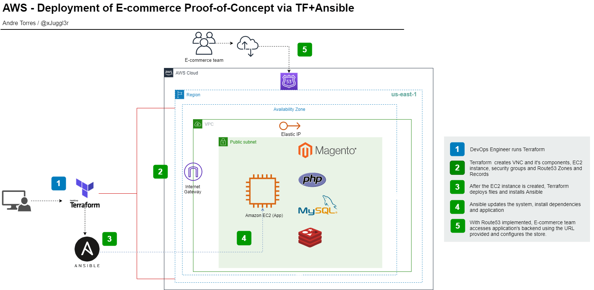

# terraform-ansible-aws-magento-poc

## Scenario
A startup is considering launching an e-commerce store using AWS.

The company's CTO would like to validate whether the new store is a viable product for the market.

Since the product is a proof of concept, it is required to fully deployed in two hours, so the Development team can finish the store still on the same day. The POC will be presented on the next day's meeting.

Due to the short deadline, automation is the best alternative for this project.
  

## Tools of choice
- Terraform for deploying the infrastructure
- Ansible for managing server and deploying the application
  

## E-commerce Stack
Magento | PHP | MySQL | Redis
  

## Cloud Architecture
<figure>
  
  <figcaption>Cloud Architecture for the POC</figcaption>
</figure>

## Points of Observation

### Security
- All sensitive data is encrypted using `ansible-vault`
  - The code can be safely updated to a repository

### Production
- If POC is approved, e-commerce will be then dockerized, autoscalable, load balanced and multi-AZ.

